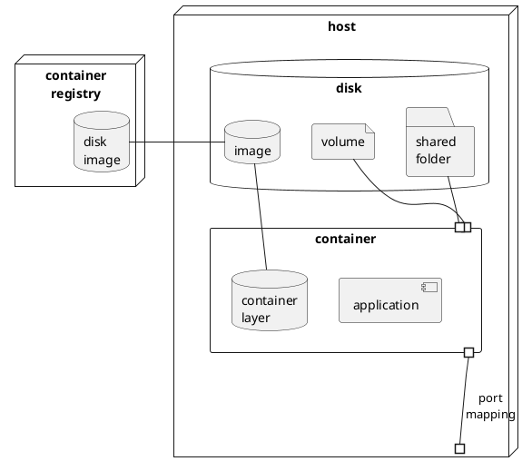

Intro to Docker
===============
8 часов, 2 ак. дня.

Recordings
==========
- [02.02](https://us02web.zoom.us/rec/share/iuujfH_CI4hQFLOCurpD_JJShLWH6tQrtU2tZxCABwYGKmek0LcBPxLb5ULJNY2Y.9UC0AvfCY3QLDc-4)
- [04.02](https://us02web.zoom.us/rec/share/_-7g0470bDMEd2PKb0JozLy1XM7Ifvnmq0bwZqwFLeOa2m96_sEUf6fgX2f7iYSG.VtsAoVl3AQ0fcc13)
- [09.02](https://us02web.zoom.us/rec/share/5xAotEhqf48L21QQH5nbtiGC_JYMV7LGKWAwXA-Hg8alROUxVtFSaeNxbsytjKgu.TRuGtV0QFyQYFj04)

Prerequisites
=============
- [ ] RAM ≥ 4Gb
- [ ] Права локального админа для аккаунта участника 
- [ ] Доступен git repo с данным руководством {{ git-repo }} `https://github.com/eugene-krivosheyev/docker`
- [ ] Доступен {{ registry-host }} `https://hub.docker.com` (Docker Hub)
- [ ] Зарегистрирована учетная запись {{ registry-account }} на {{ registry-host }}
- [ ] Установлен Docker CE или совместимый менеджер контейнеров (e.g. Podman)
```shell
sudo dnf install -y docker
```

Agenda
======
7:20

Формат
------
- две части курса: вводная и основная

Введение в Docker (15)
-----------------
- [ ] Зачем нужен Docker? Метафора морского контейнера
- [ ] Каковы функции инструментов контейнеризации?
- development environment?
- testing environment?
- production environment?
- [ ] Виртуализация (инфраструктуры) VS контейнеризация (приложения)?
- место на диске для гостевой ОС
- время запуска гостевой ОС
- overhead операций гостевой ОС
- [ ] Контейнер – процесс ОС "на стероидах": какие ресурсы необходимо изолировать и инкапсулировать?
- [ ] [Схема контейнеризации](img/container.png)
- [dockerd](https://docs.docker.com/engine/reference/commandline/dockerd/)
- [docker cli](https://docs.docker.com/engine/reference/commandline/cli/)
- disk image provisioning tool (dockercli) and Dockerfile
- disk image
- disk image registries: [docker hub](http://hub.docker.com) and corporate registries
- container = running process + container data (container layer)

<details>
<summary>puml</summary>


</details>

- [ ] Клиентский UI
- docker cli
- podman cli
- GUI в дистрибутиве для MacOS
- GUI в IDEA
- ...

- [ ] [dockerd может быть удаленный](https://nickjanetakis.com/blog/docker-tip-73-connecting-to-a-remote-docker-daemon) или в VM, а клиенты – локальные, в т.ч. windows
- [ ] Альтернативные сборщики OCI-образов без участия нативных инструментов docker: [jib](https://github.com/GoogleContainerTools/jib)
- [ ] Итого
```
Контейнер – это новый экзешник. Переносимый, безопасный и управляемый.
```

Hands-on practice quest #00: prerequisites sound-check (15+5)
---------------------------
- [ ] Given
- сделан форк данного руководства для собственных пометок
- форк открыт в браузере для внесения пометок
- для последующей удобной работы с copy+paste для ресурсов раздела [Prerequisites](#Prerequisites) плейсхолдеры заменены актуальными значениями

- [ ] Сформированы пары участников с чередованием ролей в паре
- Hint: синонимы команд docker cli
- Hint: `... --help`
- Hint: [docker cli reference](https://docs.docker.com/engine/reference/commandline/docker/)
- Hint: при работе в терминале используйте `Tab` и `↑` для автоподстановки значений

- [ ] "Как описать сценарий использования команд?"
```shell
В общем случае:
- предварительные команды подготовки системы к действию
- команды действия
- команды проверки успешности и корректности действия 
``` 

- [ ] When участники *именуют сценарии*, выполняют команды и анализируют их вывод и поведение
- Сценарий "Как ...?"
```shell
docker version # TODO: собственные пометки участников для будущего использования в проектах
docker system info
docker system df

docker events
```

- Сценарий "Как ...?"
(в новом ssh shell, чтобы параллельно видеть вывод `docker events`)
```shell
docker logout
open https://hub.docker.com/settings/security # to make Access Token
docker login -u {{ registry-account }} -p {{ access-token }} # login default hub.docker.com registry
```

- Сценарий "Как ...?"
```shell
docker image pull alpine
docker system df
````

- Сценарий "Как ...?"
```shell
docker container ls [--all]
docker container run --name demo -it alpine
/# cat /etc/os-release
/# exit 
```

- Сценарий "Как ...?"
```shell
docker container ls [--all]
docker container rm [--force] demo
```

- [ ] Then участники делятся проблемами и отвечают на вопросы
- Как проименовали сценарии?
- Успешна ли сконфигурирована система для использования docker?
- Какая версия API?
- Откуда взялся образ диска?
- Сколько места занимает образ?
- Сколько места занимает контейнер?
- Какая версия образа скачивается по умолчанию?
- Какая гостевая команда запускается при запуске контейнера?

Жизненный цикл готового образа (40)
------------------------------
### Образ
- [ ] Задача среды исполнения контейнеров: изоляция диска
- [ ] Отображение диска контейнера на диск хостовой системы: _образ_
- [ ] Что должно быть на диске для запуска и работы контейнеризованного приложения?
- [ ] Состав образа диска (от `scratch` до prod-ready)
- OS libraries
- OS Package manager (для удобной установки зависимостей, нужен на этапе сборки образа)
- OS executables (для отладки, мониторинга и траблшутинга контейнеров на этапе эксплуатации)
- Application libraries
- Application executables
- Config files
- Data files
```shell
$ docker run --rm -it alpine ls
bin    dev    etc    home   lib    media  mnt    opt    proc   root   run    sbin   srv    sys    tmp    usr    var
```

### ЖЗЛ
- [ ] Идентификация образов:
- `id` как хеш [слоя] образа
- `хост/репозиторий/имя:тег`
- `хост/репозиторий/группа/имя:тег`
- [ ] Жизненный цикл образа в репозитории и аналогии с git
- `docker container run` + side effects > `docker container commit` > `docker image push` # редко используемый "ручной" ЖЦ
- `docker image build` > `docker image push` > `docker image pull` | `docker container run` # штатный автоматизированный ЖЦ

### Структура и хранение образа
- [ ] [Хранение образа на хостовой системе](https://docs.docker.com/storage/storagedriver/select-storage-driver/): OverlayFS
- [ ] [Прием copy-on-write в OverlayFS](https://docs.docker.com/storage/storagedriver/)
```shell
$ docker image ls [--all]
REPOSITORY    TAG       IMAGE ID       CREATED         SIZE
alpine        latest    b0e47758dc53   6 weeks ago     5.33MB
hello-world   latest    a29f45ccde2a   19 months ago   9.14kB


$ docker image history ekr26/backend:1.0.0
IMAGE          CREATED      CREATED BY                                      SIZE      COMMENT
e96641ea7cdf   2 days ago   COPY dbo-1.0-SNAPSHOT.jar /dbo # buildkit       65.9MB    buildkit.dockerfile.v0
<missing>      2 days ago   ENTRYPOINT ["java" "-jar" "dbo-1.0-SNAPSHOT.…   0B        buildkit.dockerfile.v0
<missing>      2 days ago   WORKDIR /dbo                                    0B        buildkit.dockerfile.v0
<missing>      2 days ago   RUN /bin/sh -c mkdir -p /dbo # buildkit         0B        buildkit.dockerfile.v0
<missing>      2 days ago   EXPOSE map[8080/tcp:{}]                         0B        buildkit.dockerfile.v0
<missing>      5 days ago   /bin/sh -c #(nop)  ENV JAVA_HOME=/opt/java/o…   0B        
<missing>      5 days ago   /bin/sh -c set -eux;     apk add --no-cache …   96.9MB    
<missing>      5 days ago   /bin/sh -c #(nop) COPY multi:b8938281d618ac3…   16.7kB    
<missing>      5 days ago   /bin/sh -c #(nop)  ENV JAVA_VERSION=jdk8u282…   0B        
<missing>      5 days ago   /bin/sh -c apk add --no-cache tzdata --virtu…   14.2MB    
<missing>      5 days ago   /bin/sh -c #(nop)  ENV LANG=en_US.UTF-8 LANG…   0B        
<missing>      6 days ago   /bin/sh -c #(nop)  CMD ["/bin/sh"]              0B        
<missing>      6 days ago   /bin/sh -c #(nop) ADD file:f77db8e5b937d8ebb…   5.58MB


$ docker run --rm -v /var/run/docker.sock:/var/run/docker.sock nate/dockviz images -t
├─<missing> Virtual Size: 5.6 MB
│ └─<missing> Virtual Size: 5.6 MB
│   └─<missing> Virtual Size: 5.6 MB
│     └─<missing> Virtual Size: 19.8 MB
│       └─<missing> Virtual Size: 19.8 MB
│         └─<missing> Virtual Size: 19.8 MB
│           └─<missing> Virtual Size: 116.7 MB
│             └─<missing> Virtual Size: 116.7 MB
│               ├─<missing> Virtual Size: 116.7 MB
│               │ └─<missing> Virtual Size: 116.7 MB
│               │   └─<missing> Virtual Size: 116.7 MB
│               │     └─<missing> Virtual Size: 136.7 MB
│               │       └─<missing> Virtual Size: 136.7 MB
│               │         └─3c1355b22f16 Virtual Size: 136.7 MB Tags: training-docker/ekr-stub:1.0.0
│               └─<missing> Virtual Size: 116.7 MB
│                 └─<missing> Virtual Size: 116.7 MB
│                   └─<missing> Virtual Size: 116.7 MB
│                     └─<missing> Virtual Size: 116.7 MB
│                       └─e96641ea7cdf Virtual Size: 182.6 MB Tags: training-docker/ekr-backend:1.0.0
```

### Как посмотреть слои
- [ ] `docker image history` + `docker image inspect`
- [ ] Вспомогательные утилиты
- `docker run --rm -v /var/run/docker.sock:/var/run/docker.sock nate/dockviz images -t`
- `docker run -v /var/run/docker.sock:/run/docker.sock -ti -e TERM tomastomecek/sen`
- [dive](https://github.com/wagoodman/dive)
- [ ] Ограничение количества слоев: [127](https://github.com/docker/docker.github.io/issues/8230)

Hands-on practice quest #01: pre-built disk image lifecycle (15+5)
---------------------------
- [ ] Given пары участников

- [ ] When участники именуют сценарии, выполняют команды и анализируют их вывод и поведение
- Сценарий "Как ...?"
```shell
docker image ls # TODO: собственные пометки участников для будущего использования в проектах
```

- Сценарий "Как ...?"
```shell
docker image pull alpine
docker image ls
```

- Сценарий "Как ...?"
```shell
docker image history alpine

docker image inspect alpine
docker image inspect --format='{{.Id}} -> {{.Parent}}' alpine
```

- Сценарий "Как ...?"
```shell
docker container run --name demo -it alpine
/# touch side-effect.txt
/# exit
docker container diff demo
docker container commit demo {{ registry-account }}/demo
docker image ls
```

- Сценарий "Как ...?"
```shell
docker image tag {{ registry-account }}/demo:latest {{ registry-account }}/demo:1.0.0
docker image ls
```

- Сценарий "Как ...?"
```shell
docker image push {{ registry-account }}/demo:1.0.0
```

- Сценарий "Как ...?"
```shell
docker image ls
docker container rm demo
docker image prune
docker image ls
docker image rm {{ registry-account }}/demo:1.0.0
docker image ls
docker image rm {{ registry-account }}/demo:latest
docker image ls
docker image prune --all
```

- [ ] Then участники делятся проблемами и отвечают на вопросы
- Как проименовали сценарии?
- Какие способы идентификации образа?
- Какой тег у образа по умолчанию при создании коммитом?
- Какой тег у образа по умолчанию при операции `pull`?
- В чем физический смысл удаления образа командой `rm`?
- Всегда ли удаляется образ по команде `rm`?
- Что делает prune?
- Что такое [_dangling_](https://docs.docker.com/config/pruning/#prune-images) image?

Жизненный цикл контейнера (20)
-------------------------
- [ ] container = running process + container data (container layer)
- [ ] Что значит "запуск" контейнера? Что именно там запускается?
- [ ] Как можно доопределить команду, запускаемую в контейнере?

- [ ] Что нужно определить для запуска контейнера?
- [Форвардинг портов](https://docs.docker.com/engine/reference/commandline/run/#options)
- имя контейнера (+defaults)
- disk image
- virtual network
- folder | volume mapping
- entry point (image `entrypoint` override)
- guest environment variables
- command line arguments (image `cmd` override)
- [Экстернализация](https://docs.docker.com/engine/reference/run/#env-environment-variables) конфигурации приложения при запуске контейнера

- [ ] [Жизненный цикл контейнера](img/container-lifecycle.png)
- `docker container create` + `docker container start` = `docker container run` `[args]`
- `docker container pause`, `docker container unpause`
- `docker container commit`
- просмотр работающих и остановленных контейнеров `docker container ls [--all]`
- подключение к рабочему контейнеру
- просмотр лога контейнера
- `docker container stop`
- `docker container rm`

- [ ] [Запуск контейнера в интерактивном и фоновом режимах](https://docs.docker.com/engine/reference/run/#detached--d): `-d` [vs](https://stackoverflow.com/a/46898038) `-it`
- [ ] Сколько по времени будет работать контейнер?

- [ ] Можно ли запускать несколько сервисов в одном контейнере?
- [отслеживается только один процесс](https://stackoverflow.com/questions/25775266/how-to-keep-docker-container-running-after-starting-services) c PID 1 (из директив ENTRYPOINT + CMD) и по его завершению контейнер завершается тоже, жестко останавливая остальные процессы
- поэтому технически можно, но если [очень аккуратно](https://docs.docker.com/config/containers/multi-service_container/) запустить свой менеджер процессов и управлять дочерними процессами
- в целом вся философия, инструментарий и паттерны Docker [рекомендуют подход "service per container"](https://devops.stackexchange.com/questions/447/why-it-is-recommended-to-run-only-one-process-in-a-container)
- иначе сложно контейнеры отлаживать, мониторить, анализировать логи, разделять ресурсы и данные, обрабатывать падения сервисов
- для управления группой контейнеров существуют оркестраторы

Hands-on practice quest #02: container lifecycle (15+5)
---------------------------
- [ ] Given пары участников
- [optional] `sudo yum install -y jq` # json cli viewer

- [ ] When участники именуют сценарии, формируют свои команды и проверяют их вывод и поведение
- Сценарий "Как посмотреть список работающих и остановленных контейнеров?"
```shell
docker container ls --all
docker container ls --format '{{.ID}} | {{.Names}} | {{.Status}} | {{.Image}}' 
```

- Сценарий "Как запустить 'одноразовый' контейнер?"
```shell
docker container run --rm -it alpine # note `--rm`
/# exit
docker container ls
```

- Сценарий "Как запустить контейнер в фоновом режиме?"
```shell
docker container run --detach --name proxy --publish 80:80 nginx:1.19.4 # note `--detach`
docker container ls
curl localhost:80
```

- Сценарий "Как 'подключиться' к работающему контейнеру?"
```shell
docker container logs
docker container attach --sig-proxy=false # otherwise detach key `ctrl-c` will stop container 
docker container top
docker container exec -it /bin/sh
```

- Сценарий "Как посмотреть свойства контейнера?"
```shell
docker container port
docker container inspect [| jq]
```

- Сценарий "Как поставить на паузу контейнер?"
```shell
docker container pause
docker container unpause
```

- Сценарий "Как создать контейнер с сервисом без запуска?"
```shell
docker container create
```

- Сценарий "Как запустить созданный контейнер?"
```shell
docker container start
```

- Сценарий "Как остановить и запустить снова работающий контейнер?"
```shell
docker container start
docker container restart
docker container stop # send SIGTERM, and then SIGKILL after grace period
docker container kill # send SIGKILL, or specified signal
```

- Сценарий "Как удалить работающий контейнер?"
```shell
docker container rm --force
```

- Сценарий "Как удалить остановленный контейнер?"
```shell
docker container rm
docker container prune
```

- Сценарий "Как узнать и сохранить container data (container layer)?"
```shell
docker container diff
docker container commit
```

- Опциональный сценарий "Как обменяться файлами с контейнером?"
```shell
docker container cp
```

- [ ] Then участники делятся проблемами и отвечают на вопросы
- Как проименовали сценарии?
- Какие способы идентификации контейнера?
- Какое имя у контейнера по умолчанию?
- В чем физический смысл удаления контейнера?
- Что делает `prune`?
- Сколько новых layers добавила команда `commit` к базовому образу?

---

Ретроспектива (10)
-----------------------
- [ ] Ценность
- [ ] Что на производство
- [ ] Что улучшить
- [ ] Какие вопросы дозакрыть

Контейнеризация простого сервиса: автоматическая сборка образа "с нуля" (30)
--------------------------------
- [ ] Автоматическая сборка – "это другое!"
- часть CI/CD pipeline:
- требования к частоте сборок
- требования к скорости сборок
- требования к ресурсоемкости
- [ ] Какие действия необходимо совершить для подготовки образа в случае автоматической сборки?
- [ ] Экстернализация конфигурации приложения при сборке образа
- [ ] [Команда сборки образа](https://docs.docker.com/engine/reference/commandline/build/#tag-an-image--t) `docker [image] build`
- [ ] Понятие build context
- [ ] Кеширование при сборке (включая [`--pull`, `--no-cache`](https://docs.docker.com/engine/reference/commandline/build/#options))
```shell
$ docker image build .
Uploading context  6.76 MB
Step 1/2 : FROM busybox
 ---> 769b9341d937
Step 2/2 : CMD echo Hello world
 ---> Using cache
 ---> 99cc1ad10469
Successfully built 99cc1ad10469
```
- [ ] Структура Dockerfile и декларативность директив
- [ ] Ключевые [директивы Dockerfile](https://docs.docker.com/engine/reference/builder)
- [`FROM`](https://docs.docker.com/engine/reference/builder/#from) + [`--platform=`](https://www.docker.com/blog/faster-multi-platform-builds-dockerfile-cross-compilation-guide/)
- [`WORKDIR`](https://docs.docker.com/engine/reference/builder/#workdir) создаст папку при необходимости
- [`COPY`](https://docs.docker.com/engine/reference/builder/#copy) [and](https://stackoverflow.com/questions/24958140/what-is-the-difference-between-the-copy-and-add-commands-in-a-dockerfile/24958548#24958548) [`ADD`](https://docs.docker.com/engine/reference/builder/#add) from build context (+ [`.dockerignore`](https://docs.docker.com/engine/reference/builder/#dockerignore-file))
- [`RUN`](https://docs.docker.com/engine/reference/builder/#run) (+ `shell` and preferred `exec` forms) and [`SHELL`](https://docs.docker.com/engine/reference/builder/#shell) for non-default shell
- [`ENV`](https://docs.docker.com/engine/reference/builder/#environment-replacement)
- [`ARG`](https://docs.docker.com/engine/reference/builder/#arg)
- [`EXPOSE`](https://docs.docker.com/engine/reference/builder/#expose) documentation
- [`VOLUME`](https://docs.docker.com/engine/reference/builder/#volume)
- [`ENTRYPOINT`](https://docs.docker.com/engine/reference/builder/#entrypoint) [and](https://docs.docker.com/engine/reference/builder/#understand-how-cmd-and-entrypoint-interact) [`CMD`](https://docs.docker.com/engine/reference/builder/#cmd) (+ preferred `exec` and similar `default parameters to ENTRYPOINT`, `shell` forms)
```shell
docker container run [--entrypoint Dockerfile's ENTRYPOINT override] IMAGE [Dockerfile's CMD defaults override] 
```
```shell
FROM alpine
ENTRYPOINT ["echo", "Hello"]
CMD ["World"] # 'default parameters to ENTRYPOINT' form
...
$ docker build --tag test .
...
$ docker run --rm test
Hello World
...
$ docker run --rm test Alpine
Hello Alpine
```

- [ ] Системные образы для базы VS прикладные образы с приложениями
- Dockerfile should specify at least one of `CMD` or `ENTRYPOINT` commands
- `ENTRYPOINT` should be defined when using the container as an executable.
- `CMD` should be used as a way of defining default arguments for an `ENTRYPOINT` command _or_ for executing an ad-hoc command in a container
- `CMD` will be overridden when running the container with alternative arguments
- If `CMD` is defined from the base image, setting `ENTRYPOINT` will reset `CMD` to an empty value

- [ ] Версионирование создаваемого образа через теги
- опасность `:latest`
- semantic versioning
- unique tags

- [ ] Кратко по оптимизации сборки:
(подробнее в отдельном модуле)
- Сборка `FROM scratch`, "пинцетный метод"
- Изменение порядка директив в Dockerfile, чтобы максимально повторно использовать кеш Docker builder
- Объединение директив, чтобы снизить количество слоёв образа
- Multi-stage build, чтобы не тащить в итоговый образ инфраструктуру сборки
- Объединение слоёв образа в один слой
```shell
docker build --squash ...
```
[bash-docker-squash](https://github.com/qwertycody/Bash_Docker_Squash), [docker-squash](https://github.com/goldmann/docker-squash)

Hands-on practice quest #03-1: preparing base image with JRE (15)
---------------------------
- [ ] Given пары участников
- Будущая структура папок, которую участники создадут в процессе этой и следующих практик
```shell
application
├── backend
│   ├── Dockerfile
│   ├── dbo-1.0-SNAPSHOT-sources.zip
│   └── dbo-1.0-SNAPSHOT.jar
├── db
│   └── Dockerfile
├── proxy
│   ├── Dockerfile
│   └── nginx.conf
├── stub
│   ├── mappings
│   │   └── legacyAccountingSystemResponse.json
│   ├── Dockerfile
│   └── wiremock-standalone-2.27.2.jar
└── docker-compose.yml
```
- Дана рабочая папка проекта
```shell
cd application
```

- [ ] When участники именуют сценарии, формируют свои команды и проверяют их вывод и поведение
- Сценарий "Как создать и опубликовать собственный образ на основе Dockerfile?"
```shell
cat backend/Dockerfile # check it for reference of new base/Dockerfile

mkdir base
nano base/Dockerfile #TODO describe image that based on CentOS fixed fresh available version and install java-1.8.0-openjdk-headless with `yum install -y`

docker image build \
 --tag {{ registry-account }}/base:1.0.0 \ # -t
 ./base # where Dockerfile located
docker image push {{ registry-account }}/base:1.0.0
```

Hands-on practice quest #03-2: _simple_ application containerization (15+5)
---------------------------
- [ ] Given
- пары участников
- опубликованные базовые образы других команд
- Dockerfiles для основных сервисов приложения

- [ ] When участники именуют сценарии, формируют свои команды и проверяют их вывод и поведение
- Сценарий "Как задать "чужой" образ как базовый для своих следующих образов?"
```shell
cd application
nano backend/Dockerfile # TODO fix FROM for new base image
```  

- Сценарий "Как описать provision образа в Dockerfile?"
```shell
cd application/backend
cat Dockerfile # check out application's default configuration
```

- Сценарий "Как собрать свой образ с приложением на базе Dockerfile?"
```shell
cd application
docker image build \
 --tag {{ registry-account }}/backend:1.0.0 \ # -t
 ./backend
```

- Сценарий "Как сохранить образ в репозитории?"
```shell
docker login
docker image push
```

- Сценарий "Как запустить "одноразовый" контейнер на базе своего образа с приложением?"
```shell
docker container run \
 --name backend \
 --rm \ # одноразовый: удалится после остановки
 --detach \ # -d
 --publish 8080:8080 \ # -p [host address:]8080:8080
 --env SPRING_PROFILES_ACTIVE=qa \ # -e: в контейнере действует переменная окружения
 --volume $(pwd)/log:/dbo/log \ # -v: папка в конейнере /dbo/log отображена на папку на хосте /current-path/log
 {{ registry-account }}/backend:1.0.0 \ #  репозиторий и тег
 --spring.profiles.active=qa # параметры командной строки

curl localhost:8080/dbo/actuator/health
curl -X POST localhost:8080/dbo/actuator/shutdown

docker container ls --all 
```

- [ ] Then участники делятся проблемами и отвечают на вопросы
- Как проименовали сценарии?
- В каком порядке выполнялись директивы Dockerfile?
- Сколько новых layers добавила сборка к базовому образу?
- Когда и по какой причине остановился контейнер?
- Сколько раз вы столкнулись с настройкой экстернализированной конфигурации приложения?
- Какие приориеты у этих точек конфигурации?
- Что случится при запуске контейнера с параметром командной строки `docker run ... --spring.profiles.active=preprod` ?

Введение в контейнеризацию составного приложения (15)
------------------------------------------------
- [ ] Что нужно для целостной работы multi-container приложения?
- Целостная сборка образов (опционально)
- Целостный запуск, работа и завершение
- [ ] Какие ресурсы необходимо виртуализировать?
- network
- volumes/folders
- [ ] Оркестраторы:  `compose`, `swarm`, `k8s (+minikube)` и их ограничения
- [ ] Клиенты оркестраторов: Docker Compose (+build) и Docker Stack over Swarm/k8s/minikube (-build)
- [ ] Демо `cat docker-compose.yml`

Hands-on practice quest #04: _multi-component_ application containerization (25+5)
---------------------------
- [ ] Given пары участников

- [ ] When участники именуют сценарии, формируют свои команды и проверяют их вывод и поведение
- Сценарий "Как ...?"
```shell
cd application/backend
nano Dockerfile # TODO fix active Spring profile to `preprod` instead of `qa`
docker image build --tag {{ registry-account }}/backend:1.0.0 ./backend

cd application/stub
nano Dockerfile # TODO fix FROM for new custom base image
docker image build --tag {{ registry-account }}/stub:1.0.0 ./stub
```

- Сценарий "Как ...?"
```shell
cd application

docker container run \
 --detach \
 --name db \
 --publish 5432:5432 \
 --volume db:/var/lib/postgresql/data \
 --env POSTGRES_DB=dbo-db \
 --env POSTGRES_USER=dbo \
 --env POSTGRES_PASSWORD=dbo \
 postgres:11-alpine
 
docker container run \
 --detach \
 --name stub \
 --publish 8888:8888 \
 {{ registry-account }}/stub:1.0.0
curl localhost:8888/api/account [| jq]

docker container run \
 --detach \
 --name backend \
 --publish 8080:8080 \
 --env SPRING_PROFILES_ACTIVE=preprod \ # необязательно, установили как параметр командной строки в Dockerfile
 --env SPRING_DATASOURCE_URL="jdbc:postgresql://$(hostname -i)/dbo-db" \
 --env SPRING_DATASOURCE_USERNAME=dbo \
 --env SPRING_DATASOURCE_PASSWORD=dbo \
 --env SPRING_INTEGRATION_LEGACYACCOUNTINGSYSTEM_BASEURL="http://$(hostname -i):8888/api" \
 {{ registry-account }}/backend:1.0.0
curl -H "X-API-VERSION:1" localhost:8080/dbo/actuator/health [| jq]
curl -H "X-API-VERSION:1" localhost:8080/dbo/api/account [| jq]
```
open http://{{ external host ip }}:8080/dbo/swagger-ui.html

- Сценарий "Как ...?"
```shell
docker container ls [--all]
```

- Сценарий "Как ...?"
```shell
docker container stop
docker container rm [--force]
```

- [ ] Then участники делятся проблемами и отвечают на вопросы
- Как проименовали сценарии?
- По какому URL получили доступ к веб-интерфейсу приложения для тестирования работоспособности?
- Система работоспособна?
- Исходя из экстернализированных настроек, как связаны компоненты системы?
- Какие ресурсы были виртуализированы?
- Какой оркестратор использовался?

Изоляция данных (15)
---------------
- [x] Что происходит с изменениями в образе при остановке контейнера?
- [x] Как зафиксировать изменения в образе?
- [x] Как откатить изменения в образе?
- [ ] Как можно сохранять изменения на диске вне образа?
- [ ] Stateful VS Stateless containers
- [ ] [Управление данными на хостовой машине](https://docs.docker.com/storage/)
- [Shared folders](https://docs.docker.com/storage/bind-mounts/#start-a-container-with-a-bind-mount) как подмонтированные FS
```shell
cd application
docker container run --volume "$(pwd)"/folder/file:/folder/file:ro # пути у folder абсолютные, начинаются с "/"
```
- [Volumes](https://docs.docker.com/storage/volumes/) как инкапсулированные хранилища данных
```shell
cd application
docker container run --volume my_volume:/folder/file:ro # имя volume не начинается с "/"
```
- [ ] Жизненный цикл `docker volume`
- `docker volume create` | `docker run --volume` | `docker build` + Dockerfile
- `docker volume ls`
- `docker volume inspect`
- `docker volume rm` | `docker volume prune`

Hands-on practice quest #05: multi-component _stateful_ application containerization (15+5)
---------------------------
- [ ] Given пары участников

- [ ] When участники именуют сценарии, формируют свои команды и проверяют их вывод и поведение
- Сценарий "Как пробросить shared folder с хостовой системы в контейнер?"
```shell
docker container run -v # TODO Сделать proxy/Dockerfile ненужным: пробросить nginx.conf как read-only файл в контейнер proxy при его запуске (не при сборке)
```

- Сценарий "Как посмотреть volumes/folders контейнера?"
```shell
docker container inspect # "Mounts"
```

- Сценарий "Как посмотреть все текущие volumes?"
```shell
docker volume ...
```

- Сценарий "Как удалить неиспользуемую volume?"
```shell
docker volume ...
```

- Сценарий "Как управлять volume и shared folder в docker-compose?"
```shell
cd application
nano docker-compose.yml
```

- [ ] Then участники делятся проблемами и отвечают на вопросы
- Как проименовали сценарии?
- Где физически храняться volume?
- Что такое "неиспользуемые" volume?

Виртуализация сети (15)
------------------
- [x] Отображение портов
- [ ] Варианты [сетевой топологии](https://docs.docker.com/network/#network-drivers)
- [ ] Разрешение адресов и имен в виртуальных сетях
- `--name` default hostname
- `--hostname` explicit hostname
- [ ] [`localhost` issue](https://pythonspeed.com/articles/docker-connection-refused/)
- слушайте 0.0.0.0

Hands-on practice quest #06: _networked_ multi-component stateful application containerization (0)
---------------------------
- [ ] Given пары участников
- В случае podman для работы символьных имен хостов в виртуальных сетях необходимо [собрать и сконфигурировать плагин `dnsname`](https://github.com/containers/dnsname/blob/master/README_PODMAN.md)

- [ ] When участники именуют сценарии, формируют свои команды и проверяют их вывод и поведение
- Сценарий "Как создать виртуальную сеть?"
```shell
docker network ...
```

```shell
docker container run \
 --detach \
 --network my_deployment \
 --name db \
 --volume db:/var/lib/postgresql/data \
 --env POSTGRES_DB=dbo-db \
 --env POSTGRES_USER=dbo \
 --env POSTGRES_PASSWORD=dbo \
 postgres:11-alpine
 
docker container run \
 --detach \
 --network my_deployment \
 --name stub \
 {{ registry-account }}/stub:1.0.0
 
docker container run \
 --detach \
 --network my_deployment \
 --name backend \
 --env SPRING_PROFILES_ACTIVE=preprod \ # необязательно, установили как параметр командной строки в Dockerfile
 --env SPRING_DATASOURCE_URL="jdbc:postgresql://db/dbo-db" \ # hostname instead of external ip is the result of virtualizing network
 --env SPRING_DATASOURCE_USERNAME=dbo \
 --env SPRING_DATASOURCE_PASSWORD=dbo \
 --env SPRING_INTEGRATION_LEGACYACCOUNTINGSYSTEM_BASEURL="http://stub:8888/api" \ # hostname instead of external ip is the result of virtualizing network
 {{ registry-account }}/backend:1.0.0
```

```shell
cd application
nano proxy/nginx.conf #TODOs

docker image build --tag {{ registry-account }}/proxy:1.0.0 ./proxy

docker container run \
 --detach \
 --network my_deployment \
 --name proxy \
 --publish 80:80 \
 {{ registry-account }}/proxy:1.0.0
```

- Сценарий "Как подключить контейнер к виртуальным сетям?"
```shell
docker network connect 
docker network disconnect
```

- Сценарий "Как посмотреть состояние виртуальных сетей?"
```shell
docker network ls 
docker network inspect
```

- Сценарий "Как удалить виртуальную сеть?"
```shell
docker network rm
docker network prune
```

- Сценарий "Как управлять виртуальными сетями в docker-compose?"
```shell
cd application
nano docker-compose.yml
```

- [ ] Then участники делятся проблемами и отвечают на вопросы
- Как проименовали сценарии?
- Какая сетевая топология определяется по умолчанию?
- Для каких контейнеров мы определили меппинг портов? Почему не для всех?
- Как мы задаем хосты в экстернализированной конфигурации приложений? Почему не ip?

Изоляция хостовых ресурсов (20)
--------------------------
- [x] Отображение портов
- [x] Установка переменных окружения ОС для контейнера
- [ ] [Просмотр статистики потребления ресурсов](https://docs.docker.com/engine/reference/commandline/stats/)
- [ ] [Лимитирование памяти и CPU](https://docs.docker.com/config/containers/resource_constraints/)
- [ ] [Лимитирование дискового объема контейнера](https://docs.docker.com/engine/reference/commandline/run/#set-storage-driver-options-per-container)
- [ ] Лимитирование ресурсов при [запуске контейнера](https://docs.docker.com/engine/reference/run/#runtime-constraints-on-resources)
- [ ] Лимитирование ресурсов в [docker-compose](https://docs.docker.com/compose/compose-file/compose-file-v3/#deploy)
- [ ] [Как ведет себя одиночный контейнер](https://docs.docker.com/engine/reference/run/#restart-policies---restart) при ошибках контейнеризуемого приложения
- [ ] [Как ведет себя контейнер в swarm](https://docs.docker.com/compose/compose-file/compose-file-v3/#deploy) при ошибках контейнеризуемого приложения

Hands-on practice quest #07: networked multi-component stateful application _resource-limited_ containerization (10+5)
---------------------------
- [ ] Given пары участников

- [ ] When участники именуют сценарии, формируют свои команды и проверяют их вывод и поведение
- Сценарий "Как понять текущее потребление ресурсов?"
```shell
docker stats
```

- Сценарий "Как лимитировать ресурсы при запуске контейнера?"
```shell
docker container run # ограничить по CPU и памяти, чтобы получить OOME
```

- Сценарий "Как лимитировать ресурсы в docker-compose?"
```shell
cd application
nano docker-compose.yml # ограничить по CPU, чтоб не баловал и по памяти, чтобы получить OOME
```

- [ ] Then участники делятся проблемами и отвечают на вопросы
- Как проименовали сценарии?
- Какие лимиты на ресурсы устанавливаются Docker по умолчанию?
- Какое поведение отдельного контейнера при OOME по умолчанию?

Оптимизация сборки образов (20)
--------------------------
- [ ] Как уменьшить размер образа? Как ускорить сборку образа?
- [ ] Директивы Dockerfile как слои образа
- каждая директива выполняется своим контейнером
- RUN, COPY, ADD create layers
- Other instructions create temporary intermediate images, and do not increase the size of the build
```shell
docker image build --tag stub ./stub
[+] Building 2.2s (10/10) FINISHED                                                                                                                                                                                                                      
 => [internal] load build definition from Dockerfile                                                                                                                                                                                               0.0s
 => => transferring dockerfile: 328B                                                                                                                                                                                                               0.0s
 => [internal] load .dockerignore                                                                                                                                                                                                                  0.0s
 => => transferring context: 34B                                                                                                                                                                                                                   0.0s
 => [internal] load metadata for docker.io/library/openjdk:8-jre-slim                                                                                                                                                                              1.3s
 => [1/5] FROM docker.io/library/openjdk:8-jre-slim@sha256:0330883ffeb5e14c4c15271004cdf6a2df21e827420b71dca01c34e41a23690d                                                                                                                        0.1s
 => => resolve docker.io/library/openjdk:8-jre-slim@sha256:0330883ffeb5e14c4c15271004cdf6a2df21e827420b71dca01c34e41a23690d                                                                                                                        0.0s
 => => sha256:5563c7e505fa828bd868ae99f24c5a56bb0bd5488a10184f7175d10f167b0898 1.16kB / 1.16kB                                                                                                                                                     0.0s
 => => sha256:a6c8e47b54ca34cb71f873f586aaac09f73ace9bffe1b5b62eb2b05f8c974deb 7.14kB / 7.14kB                                                                                                                                                     0.0s
 => => sha256:0330883ffeb5e14c4c15271004cdf6a2df21e827420b71dca01c34e41a23690d 320B / 320B                                                                                                                                                         0.0s
 => [internal] load build context                                                                                                                                                                                                                  0.4s
 => => transferring context: 20.00MB                                                                                                                                                                                                               0.4s
 => [2/5] RUN mkdir -p /stub/mappings                                                                                                                                                                                                              0.5s
 => [3/5] WORKDIR /stub                                                                                                                                                                                                                            0.0s
 => [4/5] COPY mappings/* mappings/                                                                                                                                                                                                                0.0s
 => [5/5] COPY wiremock-standalone-2.27.2.jar /stub                                                                                                                                                                                                0.1s
 => exporting to image                                                                                                                                                                                                                             0.1s
 => => exporting layers                                                                                                                                                                                                                            0.1s
 => => writing image sha256:0a8dfafa48b9c717b862532fe441e8f2db7146a6deb8380768e6a713c75a6da4                                                                                                                                                       0.0s
 => => naming to docker.io/library/stub
```
- [ ] Кеширование включаемых файлов и результатов директив
```shell
docker image build --tag stub ./stub
[+] Building 1.9s (11/11) FINISHED                                                                                                                                                                                                                      
 => [internal] load build definition from Dockerfile                                                                                                                                                                                               0.0s
 => => transferring dockerfile: 328B                                                                                                                                                                                                               0.0s
 => [internal] load .dockerignore                                                                                                                                                                                                                  0.0s
 => => transferring context: 32B                                                                                                                                                                                                                   0.0s
 => [internal] load metadata for docker.io/library/openjdk:8-jre-slim                                                                                                                                                                              1.8s
 => [auth] library/openjdk:pull token for registry-1.docker.io                                                                                                                                                                                     0.0s
 => [1/5] FROM docker.io/library/openjdk:8-jre-slim@sha256:0330883ffeb5e14c4c15271004cdf6a2df21e827420b71dca01c34e41a23690d                                                                                                                        0.0s
 => [internal] load build context                                                                                                                                                                                                                  0.0s
 => => transferring context: 689B                                                                                                                                                                                                                  0.0s
 => CACHED [2/5] RUN mkdir -p /stub/mappings                                                                                                                                                                                                       0.0s
 => CACHED [3/5] WORKDIR /stub                                                                                                                                                                                                                     0.0s
 => CACHED [4/5] COPY mappings/* mappings/                                                                                                                                                                                                         0.0s
 => CACHED [5/5] COPY wiremock-standalone-2.27.2.jar /stub                                                                                                                                                                                         0.0s
 => exporting to image                                                                                                                                                                                                                             0.0s
 => => exporting layers                                                                                                                                                                                                                            0.0s
 => => writing image sha256:1b7c6f374f61947cd1e96233307f4fa56dfc3c0e5fd6bf228b0e7e27803ca011                                                                                                                                                       0.0s
 => => naming to docker.io/library/stub
```
- [ ] Оптимизации
- [Используйте build cache](https://docs.docker.com/develop/develop-images/dockerfile_best-practices/#leverage-build-cache): порядок директив в Dockerfile
- [Составные команды](https://docs.docker.com/develop/develop-images/dockerfile_best-practices/#sort-multi-line-arguments)
- Выбор образа-предка: легковесные ОС, busybox и `scratch`-образ

Hands-on practice quest #08: _build-optimized_ networked multi-component stateful application resource-limited containerization (15+5)
---------------------------
- [ ] Given пары участников

- [ ] When участники именуют сценарии, формируют свои команды и проверяют их вывод и поведение
- Сценарий "Как оптимизировать сборку?"
```shell
nano application/backend/Dockerfile # TODO оптимизировать сборку и убедиться в ускорении
nano application/proxy/Dockerfile
nano application/stub/Dockerfile
```

- Сценарий "Как управлять кешем сборки?"
```shell
docker builder prune [--all]
```

- [ ] Then участники делятся проблемами и отвечают на вопросы
- Как проименовали сценарии?
- Насколько получилось оптимизировать сборки в измеряемых метриках?

[Рекомендуемые практики](https://cloud.google.com/architecture/best-practices-for-building-containers) (30)
----------------------
- [ ] Минимизировать [security риски](https://snyk.io/blog/10-docker-image-security-best-practices)
1. Используйте минимальные образы: быстрее и меньше зависимостей + меньше рисков
1. Запуск в [rootless mode](https://docs.docker.com/engine/security/rootless/) или от [пользователя с минимальными привилегиями](https://docs.docker.com/engine/reference/run/#user) с возможностью при запуске [добавить прав](https://docs.docker.com/engine/reference/run/#additional-groups)
1. [Подписывать образы и проверять подписи](https://docs.docker.com/engine/security/trust/)
1. [Сканеры уязвимостей](https://techbeacon.com/security/10-top-open-source-tools-docker-security) для образов `docker scan --dependency-tree <image>`
1. [Линтеры](https://medium.com/@renatomefi/writing-dockerfile-like-a-software-developer-linting-9fd8c620174) для Dockerfile
1. [COPY вместо ADD](https://nickjanetakis.com/blog/docker-tip-2-the-difference-between-copy-and-add-in-a-dockerile)
1. Аккуратно с рекурсивным копированием + .dockerignore
1. Фиксированные теги для идентификации образов (Semantic versioning vs Unique tags)

- [ ] Хранение и передача конфигурации и чувствительных данных
- [docker experimental buildkit secrets](https://blog.alexellis.io/mutli-stage-docker-builds/)
- [docker compose secrets](https://docs.docker.com/compose/compose-file/compose-file-v3/#secrets)
- [docker swarm secrets](https://docs.docker.com/engine/swarm/secrets/)
- [docker swarm configs](https://docs.docker.com/engine/swarm/configs/)

- [ ] Локальное журналирование и доступ к логам
1. docker [logging drivers](https://docs.docker.com/config/containers/logging/configure/)
1. dedicated logs shared folders/volumes
1. remote log collectors

- [ ] Мониторинг
- [Docker как Prometheus target](https://docs.docker.com/config/daemon/prometheus/)

- [ ] ["Docker-из-docker"](https://stackoverflow.com/a/33003273)?
- [ ] [Автотесты для Dockerfile](https://medium.com/@renatomefi/unit-testing-writing-dockerfiles-like-a-software-developer-1759f416ce84)
- [ ] Паттерн [Builder](https://blog.alexellis.io/mutli-stage-docker-builds/) / ["multi-stage build"](https://docs.docker.com/develop/develop-images/multistage-build/) для конвейера разработки и поставки ПО: CI/CD pipeline
- в том числе, чтобы в итоговый образ не утекли чувствительные данные

Hands-on practice quest #09: build-optimized networked multi-component stateful application resource-limited _best practice based_ containerization (10+5)
---------------------------
- [ ] Given пары участников

- [ ] When участники именуют сценарии, формируют свои команды и проверяют их вывод и поведение
- Сценарий "Как ...?"
```shell
docker info --format '{{.LoggingDriver}}'
docker container run -it --log-driver local --log-opt mode=non-blocking --log-opt max-buffer-size=4m 
docker inspect -f '{{.HostConfig.LogConfig.Type}}'
docker logs 
```

- Сценарий "Как осуществить multi-stage сборку образа?"
```shell
cd application/backend
nano Dockerfile # TODO: BUILD stage with `mvn clean verify` and QA stage with `java -jar ... --spring.profiles.active=qa` 
```

- [ ] Then участники делятся проблемами и отвечают на вопросы
- Как проименовали сценарии?
- Какие интересные Вам метрики можно снимать?

Docker + QA = ♡ (10)
---------------
- [ ] Как Docker упрощает ручное тестирование
- Версионирование как дисциплина
- Образ для ручного тестирования с подготовленными тестовыми данными
- Легкий старт нужного окружения on demand
- Окружение тестирования больше не узкое место
- [ ] Как Docker упрощает автоматизированное тестирование
- [TestContainers](https://www.testcontainers.org)

Docker в среде Kubernetes (5)
-------------------------
- [ ] k8s больше не поддерживает docker: [все пропало](https://twitter.com/Dixie3Flatline/status/1334188913724850177)?
- [ ] Как устроен Docker? [Элементы](http://alexander.holbreich.org/docker-components-explained/).
- [ ] Как устроены аналоги? [Элементы](https://www.threatstack.com/blog/diving-deeper-into-runtimes-kubernetes-cri-and-shims).

Финальная ретроспектива (10)
-----------------------
- [ ] Ценность
- [ ] Что на производство
- [ ] Что улучшить
- [ ] Какие вопросы дозакрыть

Домашка
-------
Для желающих:
- [ ] Пройти практику до конца на stand-alone containers
- [ ] Пройти практику до конца с использованием оркестратора (docker-compose.yml compliant: `docker compose`, `docker stack` in default swarm mode, `podman compose`) 
